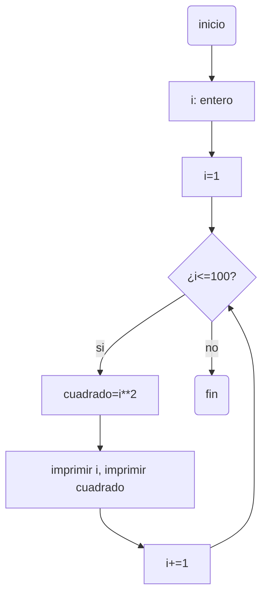
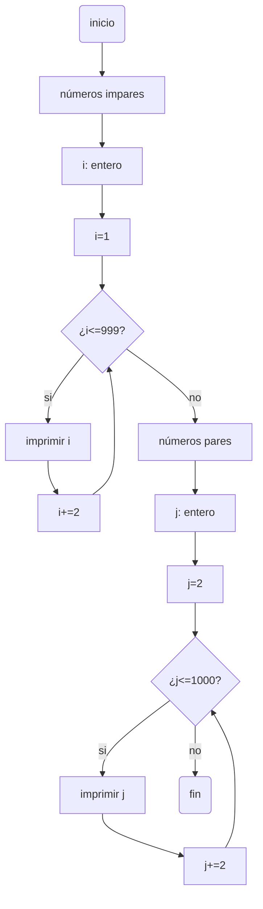
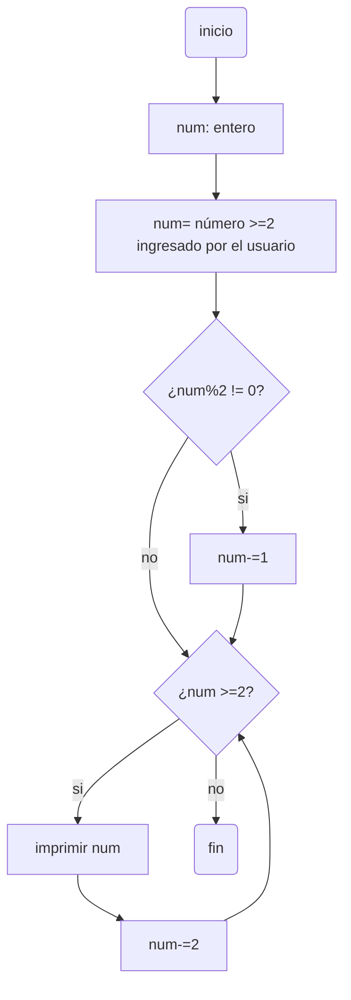

# RETO 7 while
>***PUNTO 1***
>: Imprimir un listado con los números del 1 al 100 cada uno con su respectivo cuadrado.
```python
def cuadrado (i:int)->int: #función para obtener el cuadrado de un número, recibe y devuelve un entero.
    potencia=i**2 #Se calcula la potencia del número recibido.
    return potencia #Se devuelve el cuadrado del número.
if __name__ == "__main__":
    i:int=1 #Se inicializa variable en 1.
    while i<=100: #Mientras que i sea menor o igual a 100...
        print ("NÚMERO:",i,"- CUADRADO:",cuadrado(i)) #Se imprime el número y se evalúa la función 'cuadrado' con número y el resultado se imprime.
        i+=1 #Se suma 1 a i para pasar al siguiente número.
```
#### DIAGRAMA DE FLUJO 1

>***PUNTO 2***
>: Imprimir un listado con los números impares desde 1 hasta 999 y seguidamente otro listado con los números pares desde 2 hasta 1000.
```python
if __name__ == "__main__":
    i:int=1 #Se inicializa variable en 1.
    print ("números impares:")
    while i<=999: #Mientras que i sea menor o igual a 999...
        print (i) #Se imprime i.
        i+=2 #Se aumenta i de dos en dos para obtener solo los números impares.
    j:int=2 #Se inicializa variable en 2.
    print ("números pares:")
    while j<=1000: #Mientras que j sea menor o igual a 1000...
        print (j) #Se imprime j.
        j+=2 #Se va aumentando j de dos en dos para obtener solo los número pares.
```
#### DIAGRAMA DE FLUJO 2

>***PUNTO 3***
>: Imprimir los números pares en forma descendente hasta 2 que son menores o iguales a un número natural n ≥ 2 dado
```python
if __name__ == "__main__":
    num:int=int(input("Ingrese un número natural ≥ 2 desde el cual se iniciará la lista de números pares de forma descendente hasta 2: ")) #Se solicita un número 'num'.
    if (num%2!=0): #Si num es impar se le resta 1 para que sea el número par anterior a este.
        num-=1
    while (num>=2): #Mientras que num es mayor o igual a 2...
            print(num) #Se imprime num.
            num-=2 #Se resta dos a num para pasar al anterior número par.
```
#### DIAGRAMA DE FLUJO 3

>***PUNTO 4***
>: En 2022 el país A tendrá una población de 25 millones de habitantes y el país B de 18.9 millones. Las tasas de crecimiento anual de la población serán de 2% y 3% respectivamente. Desarrollar un algoritmo para informar en que año la población del país B superará a la de A.
```python
if __name__ == "__main__":
    poblacion_A:int=25000000
    poblacion_B:int=18900000
    año:int=2022
    while poblacion_B<=poblacion_A: #Mientras que la población de B siga siendo menor o igual a la de A...
        poblacion_A=poblacion_A+0.02*poblacion_A #Se establecen la poblaciones del siguiente año, con base a las tasas de crecimiento.
        poblacion_B=poblacion_B+0.03*poblacion_B
        año+=1 #Se le suma 1 al año.
    print("En el año",año,"la población de B será mayor que la de A") #Cuando la población de B sea mayor a la de A, ya no se entrará al while, se llega a este punto y se escribe el año en el que esto sucedió.
    print("Población A:",poblacion_A,"- Población B:",poblacion_B) #Se imprimen las poblaciones de A y B para comprobar que la de B si es mayor que la de A.
```
>***PUNTO 5***
>: Imprimir el factorial de un número natural n dado.
```python
if __name__ == "__main__":
    numero:int=int(input("Escriba un número natural: ")) #Se solicita un número.
    n=numero #Se asigna el número a una variable.
    factorial:int=1 #Se inicia factorial en 1
    while n>0: #Mientras que n sea mayor que 0...
        factorial*=n #factorial toma el valor de factorial por n.
        n-=1 #Se le resta 1 a n.
    print("El factorial de",numero,"es",factorial)
```
>***PUNTO 6***
>: Implementar un algoritmo que permita adivinar un número dado de 1 a 100, preguntando en cada caso si el número es mayor, menor o igual.
```python
import random #Se importa random, para poder utilizar la función randint.
if __name__ == "__main__":
    numero:int=random.randint(1,100) #Con la función randint de random se solicita un número aleatorio entre 1 y 100 y se guarda en 'numero'.
    intento_numero:int=int(input("Intente adivinar. Escriba un número entre 1 y 100: ")) #Se solicita un número y se convierte en entero.
    while intento_numero!=numero: #Mientras que el número que se ingresa sea diferente al número aleatorio seleccionado, se pregunta lo siguiente:
        if intento_numero<numero:
            print("Ese no es el número, pruebe con uno mayor") #Si el número que se ingreso es menor a 'numero', se sugiere que se escriba uno mayor.
        else:
            print("Ese no es el número, pruebe con uno menor") #Sino, se sugiere que se escriba uno menor.
        intento_numero=int(input("Escriba otro número: ")) #Se pide que se escriba otro número y este ahora se guarda en 'intento_numero', para que ahora sea este quien se evalúe en el while.
    print("¡Felicidades! Adivinaste el número.") #Si el número ingresado no entró al while, es porque este es igual a 'numero'.
```
>***PUNTO 7***
>: Implementar un programa que ingrese un número de 2 a 50 y muestre sus divisores.
```python
if __name__ == "__main__":
    numero:int=int(input("Ingrese un número natural entre 2 y 50: ")) #Solicita un número, lo convierte a entero y lo guarda en 'numero'.
    i:int=1 #Variable de tipo entero que inicia en 1.
    print("Los divisores de",numero,"son:")
    while i<=numero: #Mientras que i sea menor o igual al número que se ingreso...
        if numero%i==0: #Se evalúa si el residuo de el número entre i es 0, si este es 0, i es un divisor de numero.
            print(i) #Se imprimen los divisores.
        i+=1 #Se suma 1 a i para evaluar si el siguiente número es divisor.
```
>***PUNTO 8***
>: Implementar el algoritmo que muestre los números primos del 1 al 100. Nota: use funciones
```python
def primo (num:int)->bool: #función que recibe un entero y devuelve un boleano.
    j:int=2 #variable entera que inicia en 2 pero irá aumentando y se comportará como divisor.
    if num==2: #Si el número que se recibe es 2, se devuelve un True, porque 2 sí es primo pero no se puede evaluar al igual que los demás.
        return True
    while j<num: #Mientras que el divisor sea menor al número...
        if num%j==0:
            break #Si el residuo de la división entre el número y j es 0, se sale del bucle, porque ya se sabe que no es primo.
        j+=1 #Se suma 1 a j para que se evalúe el siguiente número.
        if j==num: #Si se llegó a este punto y j es igual al número, significa que ya se evaluaron todos los números naturales menores que número y ninguno es su divisor, por lo cual el número es primo.
            return True #Se devuelve el True.

if __name__ == "__main__":
    i:int=1 #variable entera que inicia en 1 e irá aumentando.
    while i<=100: #Mientras que i sea menor o igual que 100...
        p=primo(i) #Se evalúa la función primo con el argumento i y se guarda en p.
        if p==True:
            print(i) #Si lo que retornó la función es True, el número es primo, así que se imprime.
        i+=1 #Se suma 1 a i para continuar con el siguiente número.
```
